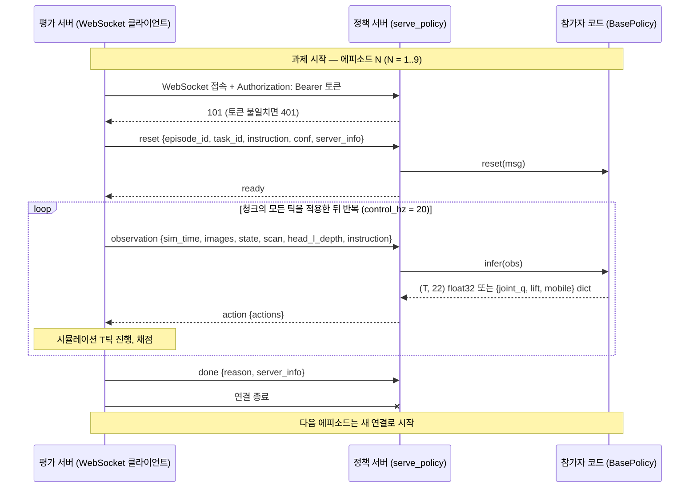
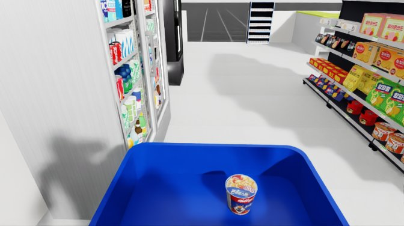
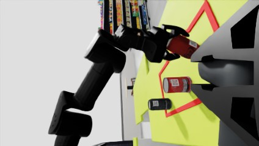
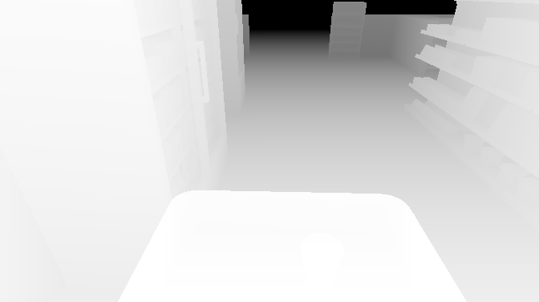
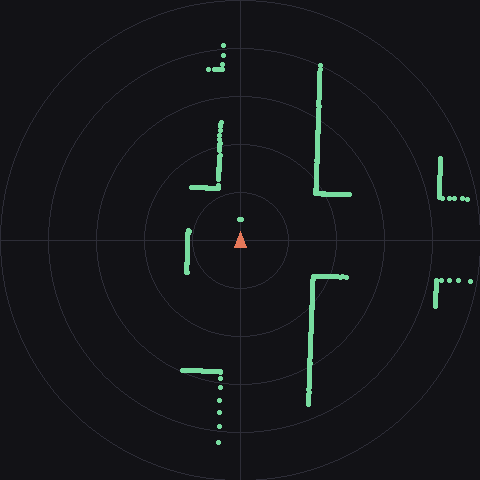

<!-- eval-host-server 프로토콜 레퍼런스. README의 과제별 규약·한도 표는 이 문서의 요약이다. -->
# 프로토콜 레퍼런스

메시지는 전부 dict이며 msgpack으로 직렬화된다. **모르는 키와 모르는 `type`은 무시한다.**
평가 서버가 나중에 필드를 추가해도 정책 서버가 종료되지 않게 하는 규칙이다.

1. 평가 서버가 정책 서버에 접속한다. `--token`을 준 서버는 `Authorization: Bearer <토큰>`
   헤더를 검증하고 불일치를 401로 거부한다.
2. 평가 서버가 `reset`을 전송하고 정책 서버는 `ready`로 응답한다.
3. 평가 서버가 `observation`을 전송하고 정책 서버는 `action`으로 응답한다.
4. 평가 서버는 액션 청크를 `control_hz` 주기로 모두 적용한 뒤 다음 `observation`을 전송한다.
5. 에피소드가 끝나면 평가 서버가 `done`을 전송하고 응답 없이 연결을 종료한다.
6. 연결 하나가 에피소드 1회에 대응한다. 다음 에피소드는 새 연결로 시작된다.

평가 서버가 `reset`을 전송하면 `serve_policy()`가 `BasePolicy.reset(msg)`를 호출한 뒤 `ready`를
응답한다. `observation`마다 `BasePolicy.infer(obs)`가 호출되고 반환값이 `action`으로 전송된다.
과제 하나는 에피소드 9회이며 아래 흐름이 에피소드마다 반복된다.



### reset

| 필드 | 타입 | 필수 | 설명 |
| --- | --- | --- | --- |
| `type` | `str` | 필수 | 메시지 종류. `reset` 고정 |
| `episode_id` | `str` | 필수 | 에피소드 식별자. 끝의 `ep<n>`이 시도 순번 |
| `task_id` | `str` | 필수 | 과제 식별자. [과제별 규약](#과제별-규약) 참조 |
| `instruction` | `str` | 필수 | 자연어 지시문 |
| `conf` | `dict` | 필수 | 실행 설정. [설정](../README.md#설정) 절 참조 |
| `server_info` | `dict` | 필수 | `{"type": "Start", "info": "Task Z-N"}` |

응답은 `{"type": "ready"}` 한 필드다. 다른 값이 오면 평가 서버가 프로토콜 오류로 종료한다.

### observation

| 필드 | 타입 | 필수 | 설명 |
| --- | --- | --- | --- |
| `type` | `str` | 필수 | 메시지 종류. `observation` 고정 |
| `sim_time` | `float` | 필수 | 에피소드 시작부터의 시뮬레이션 시각. 초 |
| `images` | `dict[str, bytes]` | 필수 | 카메라 이름별 JPEG 바이트열. 키는 `head_l`, `wrist_l`, `wrist_r` |
| `head_l_depth` | `bytes` | 필수 | 머리 카메라 depth. 16-bit 밀리미터 PNG. `decode_depth()`가 `(376, 672)` float32 m 배열로 변환 |
| `scan` | `float32[960]` | 필수 | base_link 기준 360° 2D LiDAR 거리. m |
| `state` | `dict[str, ndarray]` | 필수 | 관절·리프트·베이스 상태. 아래 표 |
| `instruction` | `str` | 필수 | 자연어 지시문. `reset`과 같은 값 |

| `images` 키 | 해상도 (H×W) | 카메라 |
| --- | --- | --- |
| `head_l` | 376×672 | 머리 ZED Mini 좌안 |
| `wrist_l` | 240×424 | 왼손목 RealSense D405 |
| `wrist_r` | 240×424 | 오른손목 RealSense D405 |

| `state` 키 | 타입 | 설명 |
| --- | --- | --- |
| `joint_q` | `float32[18]` | 액션 슬롯 0–17과 같은 순서의 관절 각도. rad |
| `lift` | `float32[1]` | 리프트 관절 위치. m |
| `mobile` | `float32[3]` | 베이스 odom 속도 (vx, vy, ωz). env 텀이 없으면 0 |

- 이미지는 `obs["images"][이름]`으로 접근하는 시점에 `(H, W, 3) uint8` numpy 배열로 디코드된다.
  접근하지 않은 카메라는 디코드하지 않는다. 해상도는 실제 로봇 SDK의 기록값으로 고정이며
  크기 변경과 정규화는 정책이 수행한다.
- `head_l_depth`는 `head_l`과 픽셀 좌표가 같고 값 `0`은 무효다. 손목 카메라에는 depth가 없다.
  **시뮬레이터의 이상화 값이라 노이즈와 구멍이 없으므로** 학습 시 노이즈 증강을 권장한다.
- `scan`의 빈 `i`는 각도 `-π + i·(2π/960)`이며 x가 전방, y가 좌측이다. 값 범위는 0.05–20.0 m이고
  `20.0`은 반사 없음이다.
- 관절 속도와 목표물의 참값 포즈는 제공하지 않는다.

**관측 예시.** 왼쪽부터 `head_l`, `wrist_l`, `wrist_r`, `head_l_depth`(가까울수록 밝음,
무효값 검정), `scan`(top-down, 중앙 삼각형이 전방, 링 간격 1 m)이다. `head_l`·`head_l_depth`·`scan`은
진열 과제의 에피소드 첫 관측이고, 손목 두 장은 계산대 과제에서 상품을 든 순간이다 — 빈 화면보다
쓸모가 있어 그 시점을 골랐다.

| `head_l` | `wrist_l` | `wrist_r` | `head_l_depth` | `scan` |
| --- | --- | --- | --- | --- |
|  |  |  |  |  |

### action

| 필드 | 타입 | 필수 | 설명 |
| --- | --- | --- | --- |
| `type` | `str` | 필수 | 메시지 종류. `action` 고정 |
| `actions` | `ndarray` 또는 `dict` | 필수 | `(T, 22)` float32 청크, 또는 아래 그룹 dict. `T >= 1` |

전송 형식은 두 가지다. 평가 서버는 둘 다 받는다.

- 평탄 배열 `(T, action_dim)` float32. 22개 슬롯을 전부 채운 청크다.
- 그룹 dict `{"joint_q": (T, 18), "lift": (T, 1), "mobile": (T, 3)}`. 관절·리프트·베이스를
  그룹별 배열로 나눠 보내는 형식이며, 평가 서버가 슬롯 순서대로 이어 붙여 22차원으로 조립한다.
  빠진 그룹은 평가 서버가 0으로 채운다. 세 그룹 밖의 키가 있거나 세 그룹이 전부 없으면
  프로토콜 오류로 에피소드가 실패한다.

| dict 키 | shape | 슬롯 | 설명 |
| --- | --- | --- | --- |
| `joint_q` | `(T, 18)` float32 | 0–17 | 양팔 14, 그리퍼 2, 목 2. 관측 `state["joint_q"]`와 같은 순서 |
| `lift` | `(T, 1)` float32 | 18 | 리프트 |
| `mobile` | `(T, 3)` float32 | 19–21 | 베이스 속도 명령 (vx, vy, ωz) |

`infer()`의 반환값은 `fill_action()`을 거쳐 위 두 형식 중 하나로 전송된다.

- `(T, action_dim)` float32 배열은 그대로 전송된다.
- `action_groups(joint_q=..., lift=..., mobile=...)`가 만든 그룹 dict는 그대로 전송된다.
- 그 밖의 dict `{"arm_r": q7, "gripper_r": -1.0}`는 정책 서버 안에서 `(1, 22)` 배열로
  변환된다. 키는 아래 레이아웃 표의 그룹 이름이고 지정하지 않은 슬롯은 0이다. 단일
  타임스텝만 만든다.
- 22보다 짧은 벡터는 뒤를 0으로 채운 `(1, 22)` 배열로 변환된다.

22차원 레이아웃은 아래와 같다. 관절 슬롯은 리셋 포즈 기준 오프셋이며 액션 `0`이 리셋 포즈 유지다.

| 인덱스 | 그룹 이름 | 내용 | 액션 1.0의 의미 |
| --- | --- | --- | --- |
| 0–6 | `arm_r` | 오른팔 관절 7 | 리셋 포즈에서 0.5 rad |
| 7–13 | `arm_l` | 왼팔 관절 7 | 리셋 포즈에서 0.5 rad |
| 14 | `gripper_r` | 오른손 그리퍼 | `-1.0`이 닫힘, `0.0`이 열림 |
| 15 | `gripper_l` | 왼손 그리퍼 | `-1.0`이 닫힘, `0.0`이 열림 |
| 16–17 | `head` | 목 관절 2 | 리셋 포즈에서 0.5 rad |
| 18 | `lift` | 리프트 | 리셋 포즈에서 0.5 m |
| 19–21 | `base` | 베이스 속도 명령 | vx 0.5 m/s, vy 0.5 m/s, ωz 1.0 rad/s |

구조화 dict의 `joint_q`는 인덱스 0–17, `lift`는 18, `mobile`은 19–21이다. 관절과 리프트는 타깃 위치이고 베이스만 속도 명령이다.

### done

| 필드 | 타입 | 필수 | 설명 |
| --- | --- | --- | --- |
| `type` | `str` | 필수 | 메시지 종류. `done` 고정 |
| `reason` | `str` | 선택 | 종료 사유. 아래 표의 값 또는 `terminated` |
| `server_info` | `dict` | 선택 | `{"type": "Done", "info": ...}` |

| `reason` | `info`의 추가 설명 | 조건 |
| --- | --- | --- |
| `full_marks` | `full marks (early stop)` | 모든 체크포인트 만점이 유지됨 |
| `max_ticks` | - | 에피소드 틱 상한 도달 |
| `success` | - | 환경이 성공 종료를 보고 |
| `stalled` | `no checkpoint progress (stall timeout)` | 총점이 무진전 |
| `all_dropped` | `all products dropped (early stop)` | 상품 전부 낙하 |
| `placed` | `placed on shelf (scoring end)` | 진열대에 놓임 |
| `dropped` | `product dropped (scoring end)` | 상품 낙하 |
| `hit` | `collision with store furniture (scoring end)` | 매장 집기와 충돌 |
| `watched` | `placed and stayed 6 s (scoring end)` | 놓은 뒤 6초 유지 |
| `terminated` | - | 위 목록 밖의 종료 사유 |

### server_info

`server_info`는 `reset`과 `done`에만 포함되고 `observation`에는 포함되지 않는다. `type`은 `Start`와
`Done` 둘뿐이며 진행 상황과 채점 정보는 전달되지 않는다.

```text
{"type": "Start", "info": "Task B-1"}
{"type": "Done",  "info": "Task B-3 | full marks (early stop)"}
```

`info`는 `"Task Z-N"` 뒤에 설명이 있으면 `" | "`로 연결한다. `Z`는 과제 문자이고 `N`은 1부터
세는 시도 번호다. 파싱은 첫 `|`로 1회만 분리한다. 추가 설명은 자연어다.

### 과제별 규약

| `task_id` | 과제 | 에피소드 | 틱 상한 | 에피소드 만점 | 잠기는 슬롯 |
| --- | --- | --- | --- | --- | --- |
| `ConvStore-Task-A` | 바구니 운반 | 9 | 12,000틱 | 0 | 없음. 22차원 전부 자유 |
| `ConvStore-Task-B` | 상자에서 진열대로 진열 | 9 | 12,000틱 | 0 | 없음. 22차원 전부 자유 |
| `ConvStore-Task-C` | 계산대 QR 스캔 | 9 | 12,000틱 | 0 | 14, 18, 19–21 |

세 과제 모두 `action_dim`은 22이고 `control_hz`는 20이며, 12,000틱은 시뮬레이션 10분이다.
점수는 에피소드 합산이다. 에피소드 만점은 채점 기준 확정 전이라 0으로 두며 확정 시 갱신한다.
Task C는 스캐너를 쥔 오른손이 고정되므로 오른손 그리퍼와 리프트, 베이스 슬롯이 잠긴다.

### 동작 규칙

- 과제가 잠근 슬롯은 평가 서버가 0으로 마스킹한다. 마스킹은 청크 수신 시점에 한 번
  적용되어 그 청크의 모든 틱에 유효하며, 거부가 아니므로 에피소드는 계속된다.
- 청크 길이가 `max_chunk_len`을 넘으면 앞에서 `max_chunk_len`개만 남기고 뒤를 버린다.
- **청크 shape가 `(T >= 1, action_dim)`이 아니거나 NaN 또는 Inf가 들어 있으면 그 에피소드는
  실패로 기록된다.**
- 관절 각속도 가드는 연속 액션 값의 차이에 `0.5 × control_hz`를 곱한 값을 아래 한도와
  비교한다. 직전 타깃과 청크 첫 행의 차이도 같은 방식으로 검사한다. 한도를 넘으면 그
  청크를 통째로 버리고 직전 타깃을 유지한다. 그리퍼와 베이스 슬롯은 검사하지 않는다.

| 관절 | 한도 |
| --- | --- |
| 팔 관절 1–3 | 3.76 rad/s |
| 팔 관절 4–6 | 6.79 rad/s |
| 팔 관절 7 | 3.06 rad/s |
| 목 관절 1–2 | 2.0 rad/s |
| 리프트 | 0.262 m/s |

### 한도와 타임아웃

| 항목 | 값 | 초과 시 동작 |
| --- | --- | --- |
| 추론 응답 타임아웃 | 30초 | 해당 에피소드를 실패로 기록한다 |
| 액션 청크 길이 | `max_chunk_len` 스텝 | 뒤쪽 초과분을 버린다 |
| 메시지 크기 | 32 MiB | 평가 서버가 연결을 종료한다 |
| 만점 상태 유지 | 시뮬레이션 2.5초 | 에피소드를 조기 종료한다 |
| 총점 무진전 지속 | 시뮬레이션 180초 | 에피소드를 종료한다 |
| keepalive ping 간격 | 30초 | 응답이 120초 없으면 연결을 종료한다 |

